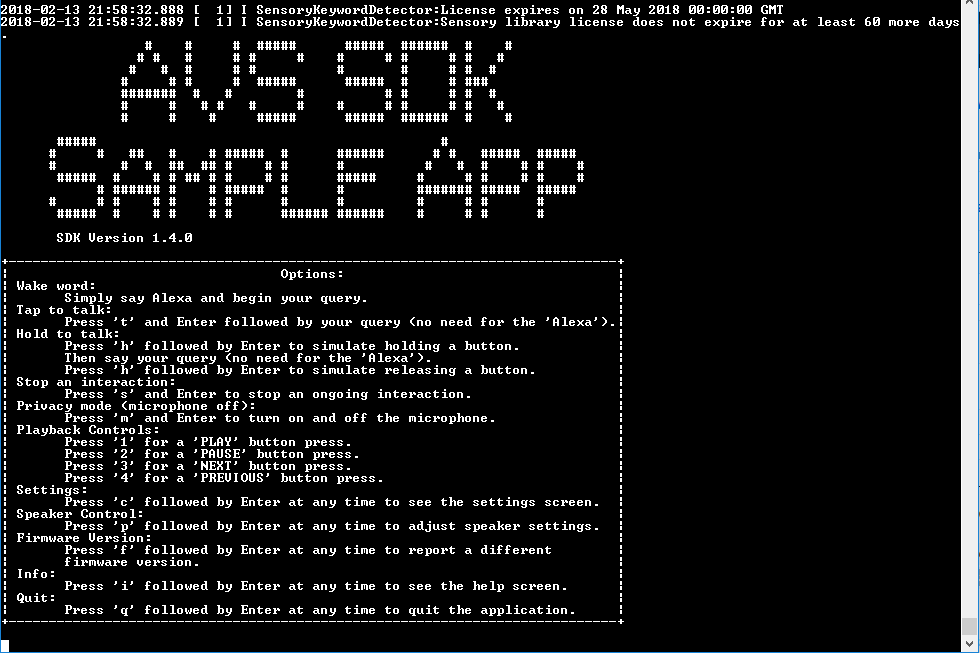
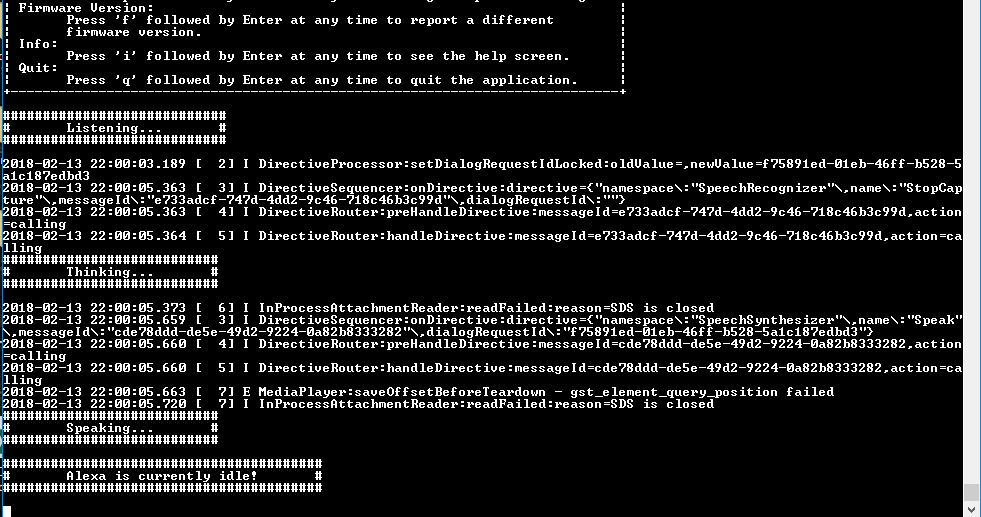

The sample application is in the folder */Alexa_SDK/avs-sdk-client/SampleApp/src/*. In order to start it, input the following command into your console window:

`sudo alexac.sh`

You should see the following screen indicating that the Sample App is ready for interaction:

  

{:.verify}
### Checkpoint 9

Say "Alexa" into the microphone array on your Synaptics 2-Mic dev kit to trigger the **Wake Word Engine**.   You should see the console status change to **Listening**, indicating the wake word was recognized.  Then say "tell me a joke." If Alexa responds with **Thinking...**, then **Speaking**, congratulations!  You have a working prototype.  

As you interact with your prototype, you should see a series of status changes annotated by your level of DEBUG set (DEBUG9 in this picture).  If you cannot hear Alexa's response, ensure your speaker/earbuds are turned on and plugged in to your Synaptics kit 3.5mm audio jack.  

If Alexa isn't responding or your Sample App appears stuck at a certain step (displaying error messages when you try to speak), just type "**s**" and hit return to stop that interaction.  You can also type "**q**" and hit return to exit from the Sample App.
