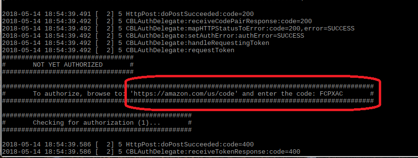

Your Pico-Pi device has the SDK installed and your credentials loaded, but your device still needs a **refresh token** in order to enable your client to maintain a connection to the AVS in the cloud.  If you design an Alexa-enabled device, and ship a million of them to your customers, they could all use the same Client ID, Client Secret, and ProductID - but each *individual* device will require a unique refresh token to authenticate with the AVS through Login With Amazon (LWA).  Typically this would be generated when your customer logs in to register the device with Alexa for the first time.  

Launch the client by typing `sudo bash alexa.c` in the terminal window.  You should see a string of messages start to scroll down the terminal screen, followed by a message indicating that your client is checking for authorization.

Scroll up until you see the authorization code as shown in this picture.  On any device, go to amazon.com/us/code and enter your code as shown on your specific device.  Your device should show a success message, and you're ready to go!
