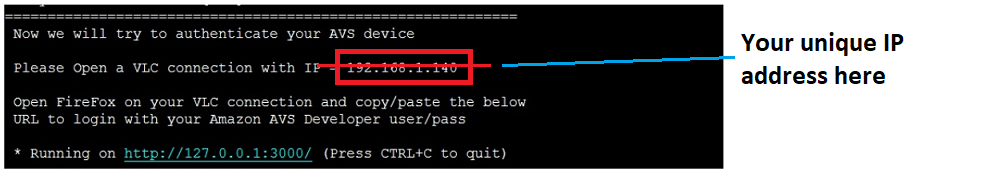

Your Pico-Pi device has the SDK installed and your credentials loaded, but your device still needs a **refresh token** in order to enable your client to maintain a connection to the AVS in the cloud.  If you design an Alexa-enabled device, and ship a million of them to your customers, they could all use the same Client ID, Client Secret, and ProductID - but each *individual* device will require a unique refresh token to authenticate with the AVS through Login With Amazon (LWA).  Typically this would be generated when your customer logs in to register the device with Alexa for the first time.  

After your credentials were entered from the previous step, in your Terminal you should see an authentication screen pop up with your Pico-Pi's unique IP address:

In step 1, you should have downloaded VNC viewer - open a VNC viewer window on your host PC.  At the top, enter your unique IP address as it was displayed in your terminal window. 

Once you input the correct IP address, you should have the option to pull up a firefox browser.  Open up the browser and input 127.0.0.1:3000 as the URL (localhost:3000).  

If your security profile was created correctly (http://localhost:3000 saved as Allowed Return URL) you should see the option to Login With Amazon (LWA).  

Log in with your developer credentials and you should see a success message displayed.  Your device can now request refresh tokens from the cloud to enable persistent connections to AVS!  As the message indicates, you can close your browser window when you see this.

{:.verify}
### Checkpoint 7

1. Navigate to your client build directory and open **AlexaClientSDKConfig.json** by pasting the following command in your terminal:
`cd /Alexa_SDK/avs-sdk-client/Integration
cat AlexaClientSDKConfig.json`

2. Verify that you have populated fields for everything in the **authDelegate** section, including **refreshToken** (it should be a very long string of characters).
