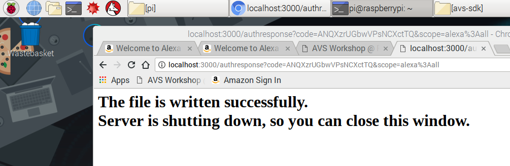

Your Pico-Pi device has the SDK installed and your credentials loaded, but your device still needs a **refresh token** in order to enable your client to maintain a connection to the AVS in the cloud.  If you design an Alexa-enabled device, and ship a million of them to your customers, they could all use the same Client ID, Client Secret, and ProductID - but each *individual* device will require a unique refresh token to authenticate with the AVS through Login With Amazon (LWA).  Typically this would be generated when your customer logs in to register their (your) device with Alexa for the first time.  

After your credentials were entered from the previous step, you should see an authentication screen pop up with your Pico-Pi's unique IP address:

In step 1, you should have downloaded VNC viewer - open a VNC viewer window on your host PC.  At the top, enter your unique IP address as it was displayed in your terminal window. 

{:.verify}
### Checkpoint 7

1. From the File Manager, navigate to */home/pi/avs-sdk/build/Integration* and open **AlexaClientSDKConfig.json** by right-clicking on it and selecting **Text Editor**.
2. Verify that you have populated fields for everything in the **authDelegate** section, including **refreshToken** (it should be a very long string of characters).
